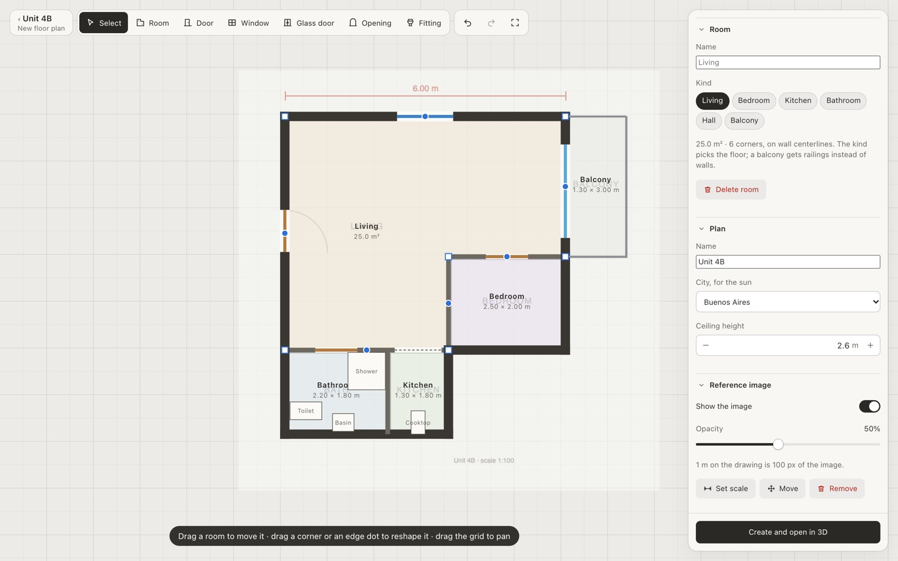

# Monoambiente

Plan your apartment in 3D: draw its floor plan, furnish it from a shared catalog of furniture, plants and lights, hang your own artwork, try paint and floors, take a wall out, walk through it and watch the real sun move across the room.


<table>
  <tr>
    <td width="50%"></td>
    <td width="50%"></td>
  </tr>
</table>

```sh
pnpm install
pnpm dev                    # http://localhost:5173: make a space, draw a plan or copy an example
pnpm build && pnpm start    # the same, as a production server on http://localhost:8080
```

## Docs

- **[Model your own apartment](docs/your-own-floorplan.md)**: make a space, draw your floor plan (or write it by hand), add your artwork and furnish it, and share it. Also covers what a fuller platform still needs.
- **[Features](docs/features.md)**: views, the decor panel, layouts and finishes, keyboard shortcuts.
- **[Development](docs/development.md)**: project map, the dev API, tests, screenshot and performance tools.
- **[Architecture](docs/architecture.md)**: layers, state, the life of an edit, rendering. The decisions behind it are in [docs/adr](docs/adr/), and the vocabulary in [GLOSSARY.md](GLOSSARY.md).
- **[Contributing](CONTRIBUTING.md)**: conventions for code, commits and docs.

## Spaces, plans and layouts

Everyone's data lives in **spaces** ([ADR 0010](docs/adr/0010-spaces.md)). A space holds a person's plans, the layouts of each plan, and their artwork, and its link is its key: there are no accounts yet, so anyone with the link can open it. The catalog of furniture, plants and lights is shared by everyone; artwork never leaves its space.

- A **plan** is an apartment: walls, openings, rooms, fittings, materials, location (for the sun) and design rules. Draw one in the floor plan editor (over a picture of your floor plan, if you have one), start from an example in `examples/`, or write the JSON by hand (type in `src/model/plan.ts`).
- A **layout** is a furnished version of a plan: its decor items, groups and finishes. A plan can have several, and A/B compare them.
- Both are checked when they load: a mistake shows up as a list of problems, not a broken scene.

The server keeps spaces as folders in `storage/` (`FLOORPLAN_DATA`), one per space, so they can be read, diffed and edited by hand. 

To bring a workspace folder in (like the apartment in the screenshots, `examples/monoambiente`, artwork included):

```sh
pnpm space:import examples/monoambiente     # prints the new space's link
```

To model your own apartment, see [docs/your-own-floorplan.md](docs/your-own-floorplan.md).
