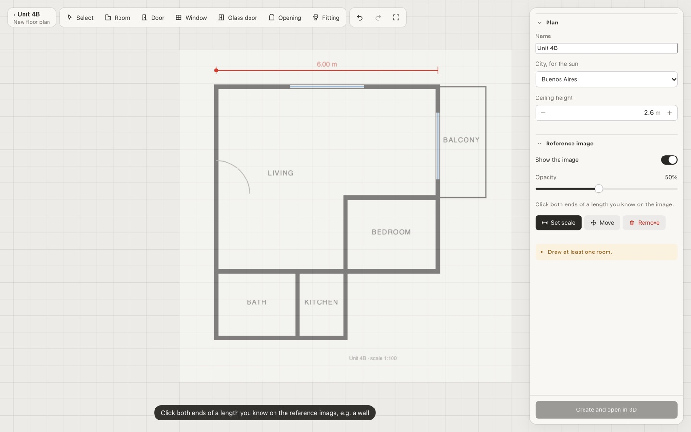

# Model your own apartment

The app doesn't depend on any one apartment. An apartment is a plan, a furnished version of it is a layout, and both live in a **space**: your corner of the server, with your plans, their layouts and your artwork ([ADR 0010](adr/0010-spaces.md)). This guide covers drawing your place, checking it, hanging your artwork and furnishing it. The last section describes what a fuller platform would still need.

## 1. Run it and make a space

You need Node 22.18 or newer and [pnpm](https://pnpm.io).

```sh
git clone https://github.com/juancuiule/floorplan.git
cd floorplan
pnpm install
pnpm dev            # http://localhost:5173
```

The home page makes a space. Its link (`/?space=<id>`) is the only key to it: there are no accounts yet, so bookmark it, and only share it with people who may edit. The home page remembers the spaces this browser opened.

A space starts empty. Its page offers two ways in: **Draw a floor plan**, or copy one of the examples (`examples/loft`, a small flat in Madrid, or `examples/monoambiente`, the studio this project was built for), furnished but without their artwork.

## 2. Measure and pick your axes

Before drawing anything, get a plan with dimensions: the building's floor plan, a sketch with a tape measure, or a listing's plan redrawn to scale. You'll need:

- every wall: where it runs, how thick it is, how tall
- every opening: doors, windows, passages (position along the wall, width, height, sill)
- the rooms (rectangles), and any ceiling that's lower than the rest
- fixed fittings: toilet, basin, shower, kitchen counter, sink, cooktop, fridge, ceiling lights
- columns and beams that stick out of walls
- the city, and which way the main window faces

Then pick axes. All numbers are in **meters**:

- `x` runs along the apartment's length. Put the entrance at `x = 0` (the inner face of the entry wall) and the **main window or balcony at the far end, on +x**. The sun controls assume the facade faces +x: the "facing" setting in the app is the compass bearing of +x.
- `z` runs across, from `0` (the inner face of one long wall) to the apartment's width.
- `y` is up, `0` is the finished floor.

Walls are drawn by their **centerline**, so a 20 cm wall whose inner face is at `x = 0` has its centerline at `x = -0.1`. Rooms, floors and ceilings are rectangles `[x0, z0, x1, z1]` of inner, usable space.

## 3. Draw the floor plan

**Draw a floor plan** on your space's page opens the editor. It works like the 3D editor: tools in the toolbar, settings in the panel on the right.

1. **Add the reference image** (panel → *Reference image*): a picture of your floor plan. It shows under the drawing, half transparent. Click *Set scale*, click both ends of a length you know on it (a dimension line, a wall you measured) and type the length: now the drawing and the image share a scale. *Move* drags the image into place.
2. **Trace the rooms.** With *Room* (`R`), click each corner of a room on its wall **centerlines**; every edge runs straight across or up the plan, so L- and U-shaped rooms are a few more clicks. Close it on the first corner (or `Enter`). For a rectangle, just drag. Corners snap to other rooms' corners, so neighbors share their wall. Pick each room's kind in the panel: it decides its floor, and a balcony gets railings instead of walls.
3. **Walls** are worked out for you and drawn as you go: 20 cm outer walls, 10 cm partitions between rooms (which a layout can later take out, Room tab → *Walls*).
4. **Doors and windows.** *Door*, *Window*, *Glass door* (floor to ceiling, e.g. onto the balcony) or *Opening* (a passage without a door): click a wall. Put the front door in the wall at the entry end: walk mode starts there.
5. **Fittings.** Toilet, basin, shower, counter, sink and cooktop: pick one, click to place it, `R` to turn it.
6. Set the **city** (for the sun) and the **ceiling height**, and **Create and open in 3D**.



With *Select*, drag a room to move it, a corner to reshape it (its neighbors follow so corners stay square), or the dot on an edge to push or pull that wall. The panel lists what is missing or wrong (overlapping rooms, no door yet) before you save. *Edit floor plan* on the space's page opens it again, reference image included. Walls must run along the plan's axes ([ADR 0011](adr/0011-right-angled-rooms.md)); for angled walls, columns or a dropped ceiling, write the plan by hand.

## 4. Or write the plan by hand

A plan is a JSON file (type in `src/model/plan.ts` and `src/model/types.ts`); `examples/loft/plans/loft.plan.json` is a short one to start from. Set `id` (lowercase, it must match the file name), `name`, `subtitle` and `location` (`lat`, `lon`, `tz` in hours from UTC, no daylight saving). Walls are drawn by their centerline; rooms, floors and ceilings are rectangles `[x0, z0, x1, z1]` of inner, usable space. What each part is for:

| Field | What goes there |
|---|---|
| `materials` | Named colors and surface patterns (`planks`, `tiles`, `herringbone`, `hex`, `concrete`, `quarter`). Walls, floors and fixtures refer to them by name. |
| `shell.walls` | One entry per straight wall: `a` and `b` (centerline ends), `thickness`, `height`, `kind` (`exterior` walls are cut away in dollhouse view), `material`, and its `openings`. |
| `openings` | `kind` (`door`, `window`, `passage`), `offset` (from the wall's `a` end to the near edge), `width`, `height`, `sill` for windows, `leaf` for a door (hinge side, swing, how open) and `glazing` for windows. |
| `shell.rooms` | Named rectangles with their own floor material, if any, and whether to show a label. |
| `shell.baseFloors` | The continuous floor under everything that has no room floor of its own. |
| `shell.ceilings` | Ceiling rectangles and heights (a dropped ceiling over an entry is a second, lower one). |
| `shell.bulges` | Columns, beams and soffits: boxes attached to a host wall. |
| `shell.accentPanels` | Wall faces that can be painted in an accent color. |
| `shell.slab` | The slab under the whole flat. |
| `fixtures` | Fittings that don't move: `toilet`, `basin`, `showerTray`, `counter`, `kitchenSink`, `cooktop`, `fridge`, `downlight`, `railing`, or a plain `box`. `position` is the footprint's center at floor level; local +z is the front; `rotation` is in degrees. |
| `walls.labels` | Readable names for walls in the UI. |
| `walls.roles` | Which wall is the `facade` and which are `party` walls shared with neighbors (used for sun shadows). |
| `walls.removable` | Partitions that can come out in a "what if" layout, what they take with them, and the floor patch left under them. |
| `walls.accent` | Walls offered as accent walls. |
| `cameras` | Optional camera presets. Missing ones are derived from the plan's bounds. |

A few material names are special: the Room tab controls them, so leave them undefined or give them a default and the app will swap in the chosen finish:

- `floorMain`, `floorHall`, `bathFloor`, `balconyFloor`: the four floor zones (main room, hall + kitchen, bathroom, balcony)
- `plaster`: wall paint
- `ceiling`, `tile` (bathroom wall tile)

To bring a hand-written plan in, put it in a workspace folder shaped like `examples/loft` (`workspace.json`, `plans/`, optionally `layouts/` and `artwork/`) and import it as a new space:

```sh
pnpm space:import path/to/myflat          # prints the new space's link
```

After that, the plan file is `storage/spaces/<space>/plans/<id>.plan.json`: edit it there and reload. If something in it is wrong (an opening longer than its wall, a fixture of an unknown type, a reference to a wall that doesn't exist), the page lists the problems instead of drawing the plan.

**Let Claude Code do the transcription.** Give it the plan image and your measurements and ask it to write the plan following `examples/loft/plans/loft.plan.json` and the types in `src/model/plan.ts`. Then check it in the app with the measure tool and ask for fixes.

## 5. Check it

- `?view=top` shows the plan from above, and `M` toggles dimensions.
- `T` is the measure tool: click two points to take a dimension, snapping to edges.
- `X` makes the walls translucent; the dollhouse view cuts away the walls facing the camera.
- `W` (or double-click the floor) walks through it at eye level.

## 6. Hang your artwork

Upload images in the Artwork tab, or drop them anywhere on the panel. They go to your space's library, which every plan in the space shares and no other space can see. Pick an image, click a wall to hang it, then choose print size, crop, frame and height. See [features.md](features.md#decor-panel) for everything the panel does.

## 7. Furnish it

The Furniture, Plants and Lights tabs place pieces from the catalog, which every space shares. Every change is saved to the open layout, so you can:

- keep several layouts (the menu at the top of the panel) and flip between two with `B`,
- try taking a partition out (Room tab → *Walls*) and compare it with the original,
- edit a layout file by hand (`storage/spaces/<space>/layouts/<plan>/decor*.json`), or ask Claude Code to ("move the sofa 20 cm toward the window"), and watch the app update live.

## 8. Add a piece that isn't in the catalog

Furniture is parametric code, not imported 3D models. Each piece is built from boxes and simple shapes, with editable dimensions and finishes. Adding one takes four changes:

1. Add its name to `FurnitureType` in `src/model/decor.ts`.
2. Describe it in its catalog group's file under `src/decor/furniture/` (`sleep.ts`, `sit.ts`, `devices.ts`…; the type is `FurnitureSpec` in `spec.ts`): label, group, how it mounts (floor, wall, ceiling), default size, which finishes it uses, and its options (toggles, choices, ranges).
3. Draw it: a component in the matching file under `src/scene/decor/furniture/` (`Seating.tsx`, `Storage.tsx`, `Devices.tsx`…), registered in `VIEWS` in `Furniture.tsx`. Look at a similar piece first; `common.tsx` has the shared helpers.
4. Run `pnpm test`: `tests/unit/catalog.test.ts` checks every catalog entry.

This is a good job for Claude Code: give it a product link or photo and dimensions, and point it at a similar existing piece.

## 9. Share it

`pnpm build && pnpm start` runs the app and its API as one server (port 8080, data in `storage/` or `FLOORPLAN_DATA`). Run it where others can reach it and send them a space's link: whoever has it can open and edit that space, and nothing else.

## Toward a platform

What exists now ([ADR 0010](adr/0010-spaces.md)):

| | Where | Owned by |
|---|---|---|
| **Space** | `storage/spaces/<id>/`, reached by an unguessable link | whoever has the link |
| **Plan** | `<space>/plans/<id>.plan.json`, drawn in the editor, copied from an example or written by hand | the space |
| **Layout** | `<space>/layouts/<plan>/decor*.json` | the space |
| **Artwork** | `<space>/artwork/`, served at `/api/spaces/<id>/artwork/` | the space, never shared |
| **Catalog** | furniture, plants and lamps in code (`src/decor/`) | shared by everyone |
| **Templates** | `examples/` | shared; copies have no artwork |

What's still missing:

- **Accounts**: an owner for each space, sign-in, and links that can only view. Today a link gives full access.
- **A database and object storage**: the storage module (`server/storage.ts`) is the seam. Files are fine for a few people; many need concurrency control (today the last write wins) and backups.
- **Richer drawing**: angled walls, columns and beams, dropped ceilings, tracing over an image of the floor plan, or a first pass from a photo of one.
- **Catalog as data**: furniture specs (size, options, finishes) could live in a database, but the geometry is code; a request flow could produce a pull request, or pieces could be described in a small declarative format.
- **Some assumptions from the original flat** still live in the code: the four floor zones in the Room tab (`src/model/finishes.ts`), the bathroom tile and shower options, and a balcony in the sun shadows (`src/scene/SunOccluders.tsx`). A plan without a bathroom or balcony works, but those options still show.
- **Asset rights and limits**: uploads need storage quotas and a way to report or remove images.
